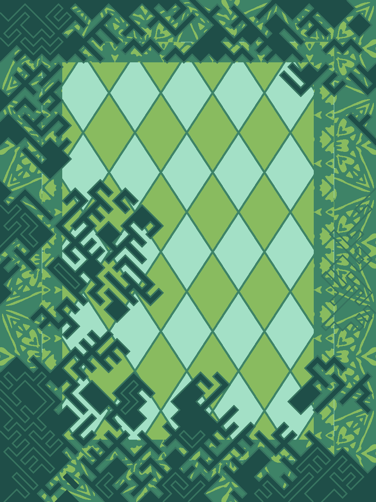

# Carpet Design Variations Generator

## Overview
This project generates five variations of a given carpet image in terms of color and pattern using a fine-tuned Stable Diffusion ControlNet. The system also allows prompt-based generation, with embeddings handled by CLIP.

## Features
- Accepts a single carpet image as input.
- Generates five variations of the input image.
- Variations include both color and pattern changes.
- Utilizes Stable Diffusion ControlNet for fine-tuned image generation.
- Supports prompt-based generation for more customization.
- Embeddings are handled using CLIP.


## Fine-Tuning Details
- **Dataset**  Around 5000 images provided by Alternative Technology Company
- **Process** LoRA (Low-Rank Adaptation)
- **Epochs** 2
- **GPU** Lightning L4
- **Inferencing Time**  5 seconds per variation
  
## Technologies Used
- **Stable Diffusion** (runwayml/stable-diffusion-v1-5)
- **ControlNet** for guided image generation
- **CLIP** for embedding handling
- **Diffusers Library** for image generation pipelines
- **OpenCV & PIL** for image processing
- **PyTorch** for deep learning models

## Installation
### Prerequisites
Ensure you have the following installed:
- Python 3.8+
- PyTorch (with CUDA support if available)
- Required Python libraries 

### Install Dependencies
```bash
pip install torch torchvision torchaudio
pip install diffusers opencv-python numpy pillow matplotlib
```

## Usage
### 1. Prepare Your Model
Ensure you have the required models downloaded in the appropriate directories:

Link to saved model :  https://drive.google.com/drive/folders/1klmICMKHIkIax3o94EK07qprmzV6v6Rg?usp=sharing

- Image Encoder: `./models/image_encoder/`
- Model Checkpoint: `./models/model_checkpoint.bin`

### 2. Run the Script
To generate variations for a single carpet image:
```bash
python main.py
```

### 3. Output
The generated images will be saved in the working directory with names like:
```
test_output_0.png
test_output_1.png
test_output_2.png
test_output_3.png
test_output_4.png
```

## Results
Below is an example of an input image(First image) and its five generated variations:

<p align="center">
  
  
  
  
  
  
</p>
<p align="center">
  
  
  
  
  
  
</p>
<p align="center">
  
  
  
  
  
  
</p>


## Customization
- Modify the `sample_count` parameter in `generate_images()` to control the number of variations.
- Change the `steps` parameter for different levels of refinement.
- Use a different `seed` value for unique generations.

## Acknowledgments
This project leverages the power of **Stable Diffusion, ControlNet, and CLIP** to achieve high-quality image transformations.

